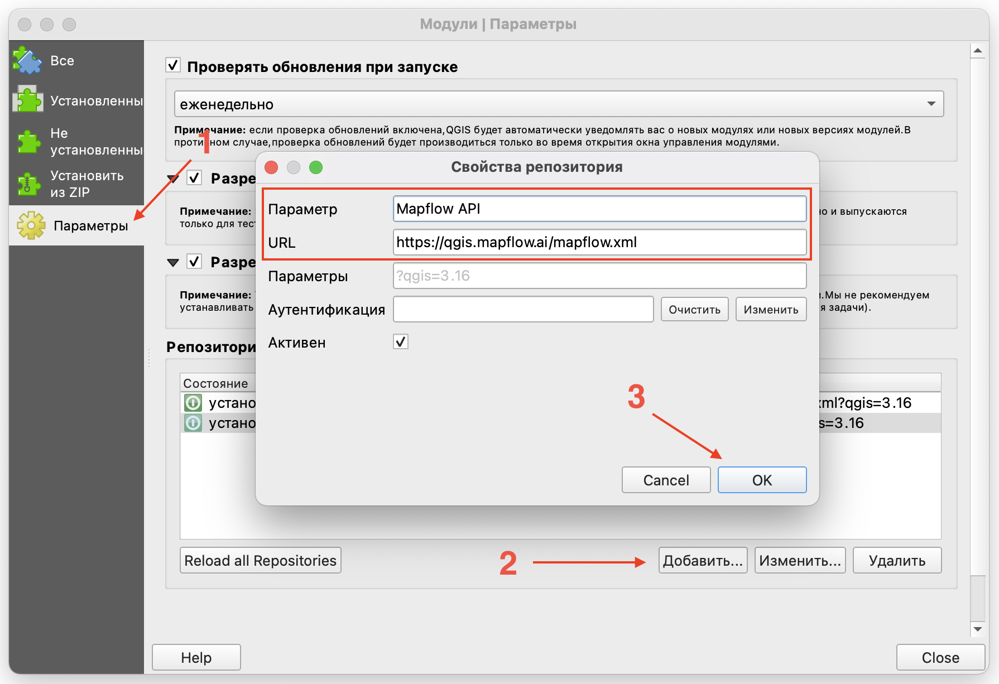
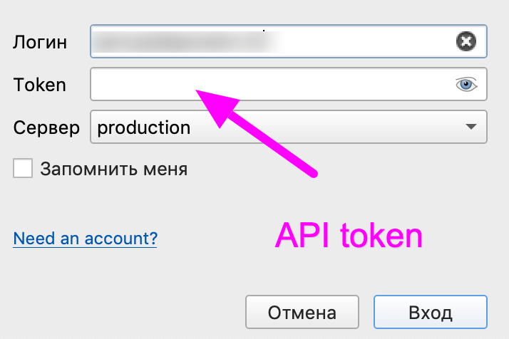
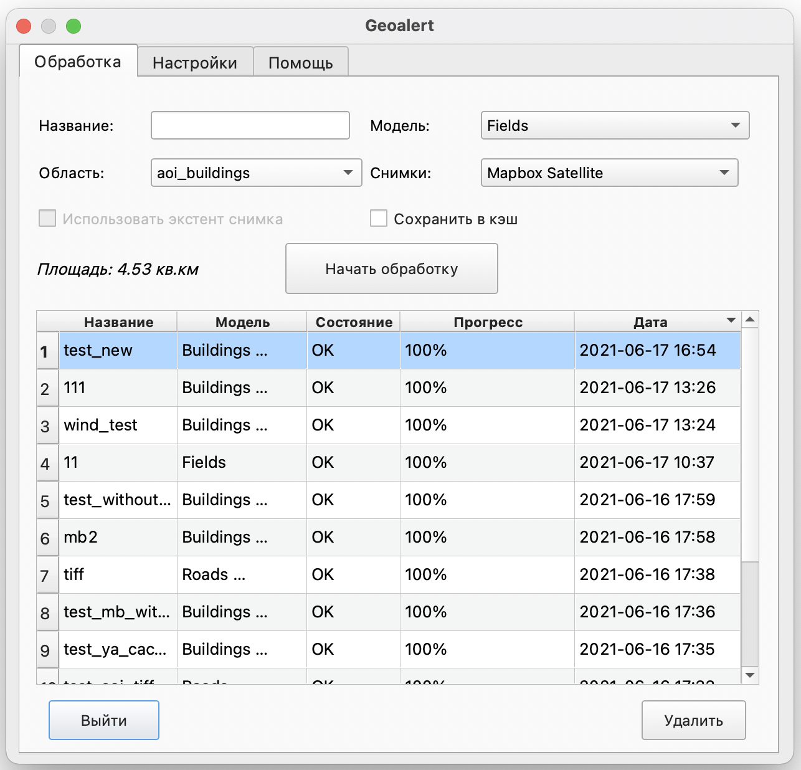
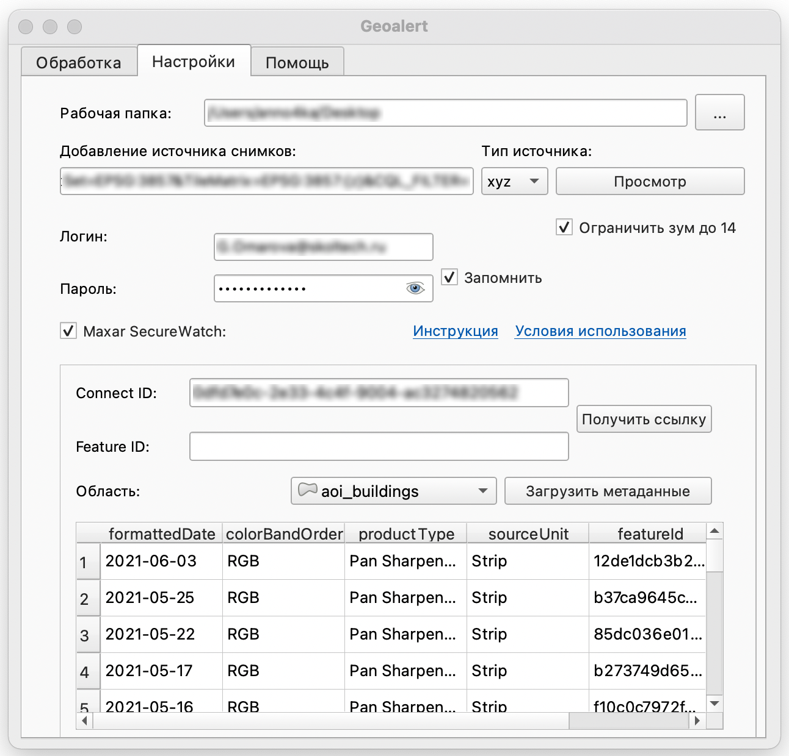
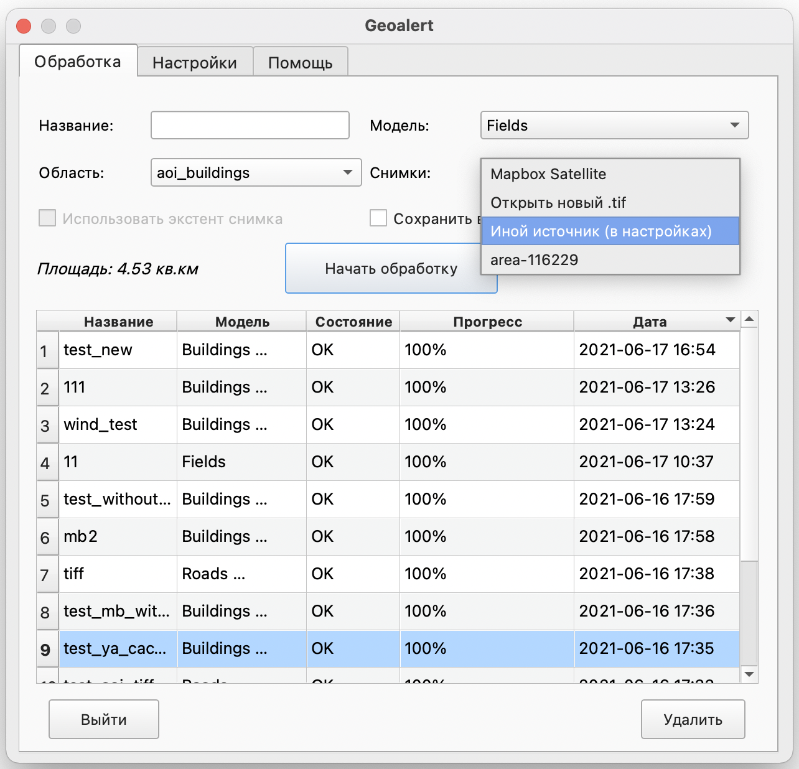

QGIS
=============

.. attention::
 Данное приложение позволяет использовать возможности платформы Mapflow в QGIS. Для его использования потребуется доступ к :doc:`processing_api` - см. :doc:`авторизация <../docs_userguides/mapflow_auth>`.

Что такое QGIS
---------------

**QGIS** - это наиболее популярная настольная ГИС с открытым исходным кодом. Пользователи могут визуализировать, управлять, редактировать, анализировать данные и составлять печатные карты. Узнайте больше на официальном сайте `QGIS <https://www.qgis.org/>`_. 

При помощи данной ГИС  вы сможете подключить больше приложений и расширить функциональность, поскольку данная система имеет ресурсы для подключения внешних плагинов разработанных на Python. Наше приложение позволяет подключаться к Mapflow :doc:`processing_api` для запуска AI-моделей обработок и получать результаты процессинга в виде слоев для QGIS.

Как установить плагин
----------------------

Для начала вам необходимо добавить внешний репозиторий с нашего сайта. Для этого нажмите Модули -> Управление и установка модулей… -> Параметры -> Добавить…, в появившемся окне заполните поля Параметр (имя) и URL-адрес репозитория.

Далее перейдите во вкладку Не установленные (или Все) и введите в поисковую строку название нашего плагина - Geoalert MapFlow. Нажмите Установить плагин.

Теперь иконка плагина появилась в области Панель инструментов QGIS. Если автоматически иконка не отобразилась, нажмите правой кнопкой мыши по Панели инструментов и поставьте галочку рядом с Geoalert.
         

Пользовательский интерфейс
---------------------------

Для использования плагина необходимо авторизоваться под своей учетноой записью. Зарегистрируйтесь и напишите в службу поддержки на сайте платформы запрос на предоставление доступа к API для работы с плагином.

Окно авторизации
~~~~~~~~~~~~~~~~

  
.. list-table::
   :widths: auto
   :header-rows: 1

   * - Название поля / кнопки
     - Описание
   * - Логин / Пароль
     - Поля, предназначенные для ввода данных учетной записи пользователя.
   * - Сервер
     - Выбор платформы к которой плагин будет обращаться для запуска обработки.
   * - Запомнить меня
     - Сохранение персональных данных пользователя для использования плагина при дальнейшем выходе из своей учетной записи.   
   * - Вход
     - Кнопка входа в учетную запись пользователя.
   * - Отмена
     - Кнопка закрытия окна авторизации плагина.

Рабочее окно плагина Geoalert
~~~~~~~~~~~~~~~~~~~~~~~~~~~~~

:ref:`Обработка`

:ref:`Настройки`

:ref:`Помощь`

.. _Обработка:

1. Обработка
~~~~~~~~~~~~~~~

**Область параметров обработки**

.. csv-table::
    :file: _static/qgis/processing_parameters_area.csv 
    :header-rows: 1 
    :class: longtable
    :widths: 1 3  

**Запуск обработок и работа с результатами обработок**

.. list-table::
   :widths: auto
   :header-rows: 1

   * - Название поля / кнопки
     - Описание
   * - Название
     - Название обработки.
   * - Модель
     - Выбранный пользователем тип обработки в поле AI model.
   * - Состояние
     - Статус обработки. IN_PROGRESS - производится обработка, OK - обработка завершилась, FAILED - обработка завершилась неудачно.
   * - Прогресс
     - Степень завершенности обработки в процентном соотношении.
   * - Дата
     - Дата создания обработки.

Чтобы выгрузить результаты обработки, нажмите на завершенную обработку двойным щелчком.

.. _Настройки:

2. Настройки
~~~~~~~~~~~~

.. list-table::
   :widths: auto
   :header-rows: 1

   * - Название поля / кнопки
     - Описание
   * - Рабочая папка
     - Путь к директории, в которую будет загружен результат обработки.
   * - Добавление источника снимков
     - URL-адрес поставщика результатов спутниковой съёмки.
   * - Тип источника
     - Растровый тип тайла. Можно выбрать xyz, tms, wms.
   * - Просмотр
     - Кнопка предпросмотра подложки указанного поставщика спутниковой съёмки и геопространственных данных.
   * - Ограничить зум до 14
     - Зум размера 14 выбран по умолчанию, чтобы исключить расход платного трафика на предпросмотр (Актуально в случае подключения к Maxar SecureWatch. Просмотр данных с этого сервиса возможен с 9 зума. Можно использовать приближение до максимального 18 зума, сняв галочку).

**Настройки Maxar SecureWatch**

.. list-table::
   :widths: auto
   :header-rows: 1

   * - Название поля / кнопки
     - Описание
   * - Логин / Пароль
     - Данные для входа в учетную запись SecureWatch.
   * - Запомнить
     - Сохранение персональных данных пользователя для дальнейшей возможности подключения к ресурсам SecureWatch.
   * - Connect ID
     - Идентификатор подключения к ресурсам SecureWatch.
   * - Получить ссылку
     - Кнопка для получения URL-адреса поставщика данных спутниковой съёмки Maxar.
   * - Feature ID
     - Идентификатор изображения, пересекающегося с выбранной AOI областью, полученный из метаданных.
   * - Область
     - Область, по которой будут представлены метаданные.
   * - Загрузить метаданные
     - Кнопка для запуска сбора метаданных по выбранной области. После ее нажатия внизу появится таблица со всеми изображениями, пересекающимися с выбранной областью обработки.

.. _Помощь:

3. Помощь
~~~~~~~~~

Во вкладке размещены все полезные ссылки для работы с данным плагином.

Как подключиться к Maxar SecureWatch
------------------------------------

.. note::
    **SecureWatch** - это сервис по подписке, который обеспечивает глобальный доступ к спутниковым снимкам мирового лидера в области ДЗЗ, компании MAXAR. Пространственное разрешение снимков варьируется в диапазоне от 30 см до 1 м. Все снимки сопровождаются метаданными, включая информацию о дате и времени съемки, угле съемки и облачном покрове, пространственном разрешении, уровне обработка снимка и др. В нашем плагине реализован специальный интерфейс для работы с этим сервисом, позволяющий искать и просматривать снимки, а также использовать их для обработки в Mapflow.ai, оптимизируя при этом объем скачиваеемых данных.

На вкладке **Обработка** в выпадающем списке *Снимки* выберите *Иной источник (в настройках)*.

2. Перейдите на вкладку **Настройки**.
 
3. Введите ваши данные учетной записи  SecureWatch в поля *Логин* и *Пароль*.

.. important:: 
    Если у вас нет учетной записи, зарегистрируйтесь на официальном сайте `SecureWatch <https://explore.maxar.com/securewatch-demo>`_.
 
4. Выберите *Maxar Securewatch*. Введите ваш *Connect ID*. Для этого:

     4.1. Перейдите на `SecureWatch <https://securewatch.digitalglobe.com/myDigitalGlobe/logout-from-ended-session>`_.

     4.2. В строке заголовка выберите свое имя, затем выберите **View Profile**. Откроется диалоговое окно **User Profile**.
 
     4.3. Скопируйте свой идентификатор подключения с поля **Current Connect ID**.
     
     .. figure:: _static/qgis/SecureWatch_user_profile.jpg
         :alt: Your user profile in SecureWatch
         :align: center
         :width: 15cm

     .. attention::
         Обратите внимание, что **Connect ID** разный в зависимости от доступных вам продуктов спутниковых мозаик. Поэтому выберите изначально ту, которая вам подходит. Для этого закройте окно *User Profile* и в строке заголовка выберите нужный из предложенных продуктов (например, **Vivid** или **SecureWatch**, но их перечень зависит от условий вашего тарифного плана).

     4.4. Вернитесь в QGIS к плагину **Geoalert**, в поле *Connect ID* вставьте скопированный индентификатор.
   
5. Нажмите *Получить ссылку*. 
     
Теперь слой Maxar доступен для предварительного просмотра в вашем списке растровых слоев и для обработки с помощью платформы Mapflow.

Как найти, просмотреть и обработать конкретный снимок, используя Maxar SecureWatch
~~~~~~~~~~~~~~~~~~~~~~~~~~~~~~~~~~~~~~~~~~~~~~~~~~~~~~~~~~~~~~~~~~~~~~~~~~~~~~~~~~

Используя SecureWatch, вы можете найти и обработать снимок на интересующую область, используя поиск по всем доступным данным.

1. Активируйте рабочую область настройки *Maxar SecureWatch*.

2. С помощью выпадающего списка *Область* выберите границы интересующей вас области обработки.

.. note::
    Область должна быть создана или загружена из файла, как полигональный векторный слой QGIS.

     .. figure:: _static/qgis/add_SW_WFS.png
         :alt: Get specific image from SW
         :align: center
         :width: 15cm    

3. Нажмите  *Получить метаданные*, чтобы просмотреть все имеющиеся снимки, перескающиеся с вашей областью обработки.

4. С помощью выведенного списка полученных снимков, выберите наиболее подходящий для вас из перечня и выделите его в списке.

.. note::
    Метаданные найденных снимков загружаются с использованием протокола WFS и отображаются в виде векторного слоя в дереве слоев. Вы можете работать с ним, как с любым векторным слоям, оперируя всеми атрибутами таблицы атрибутов.

5. Нажмите *Получить ссылку*, чтобы сформировать запрос к выбронному снимку (параметр *Feature ID*).

6. Нажмите *Просмотр*, чтобы просмотреть выбранный снимок в отдельном растровом слое.

.. attention::
    Параметр *ограничить зум до 14* служит для ограничения расхода платного трафика на стороне сервиса SecureWatch. Если вы хотите просматривать снимок в полном разрешении - отключите чекбокс и заново нажмите *Просмотр*.

Как использовать другие сервисы изображений
-------------------------------------------

Вы можете ввести URL-адрес источника данных спутниковой съёмки в одном из следующих форматов:

* XYZ;
* TMS;
* WMS;
* Quadkey.

Все форматы представляют собой наиболее широко используемые стандарты для получения изображений с географической привязкой через http.

Как обрабатывать ваши собственные изображения
----------------------------------------------

Вы можете загрузить свой локальный растр в формате GeoTIF (*Открыть новый .tif*). Каждый файл, добавленный в качестве растрового слоя в QGIS, отображается в раскрывающемся списке и может быть выбран для загрузки и обработки. Открытие файлы через *Открыть новый .tif* также добавляет его в список слоев QGIS с возможностью выбора.

 .. figure:: _static/qgis/upload_tif.png
         :alt: Upload TIF, select from list
         :align: center
         :width: 15cm
