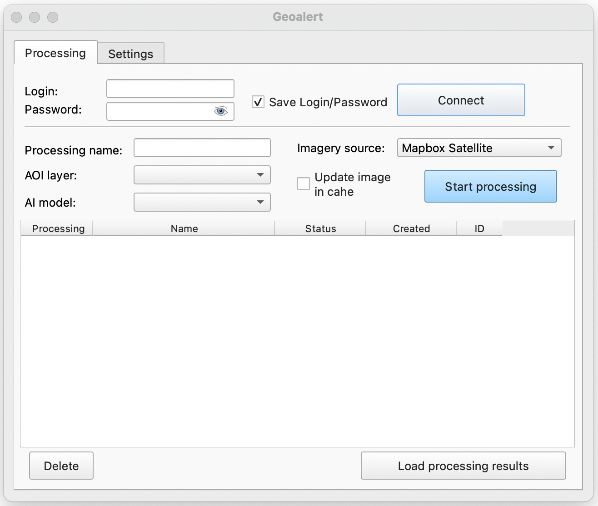
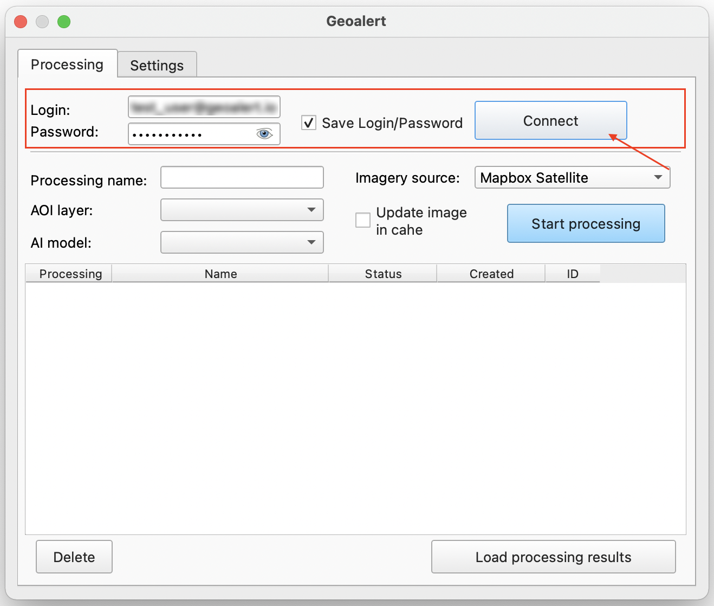
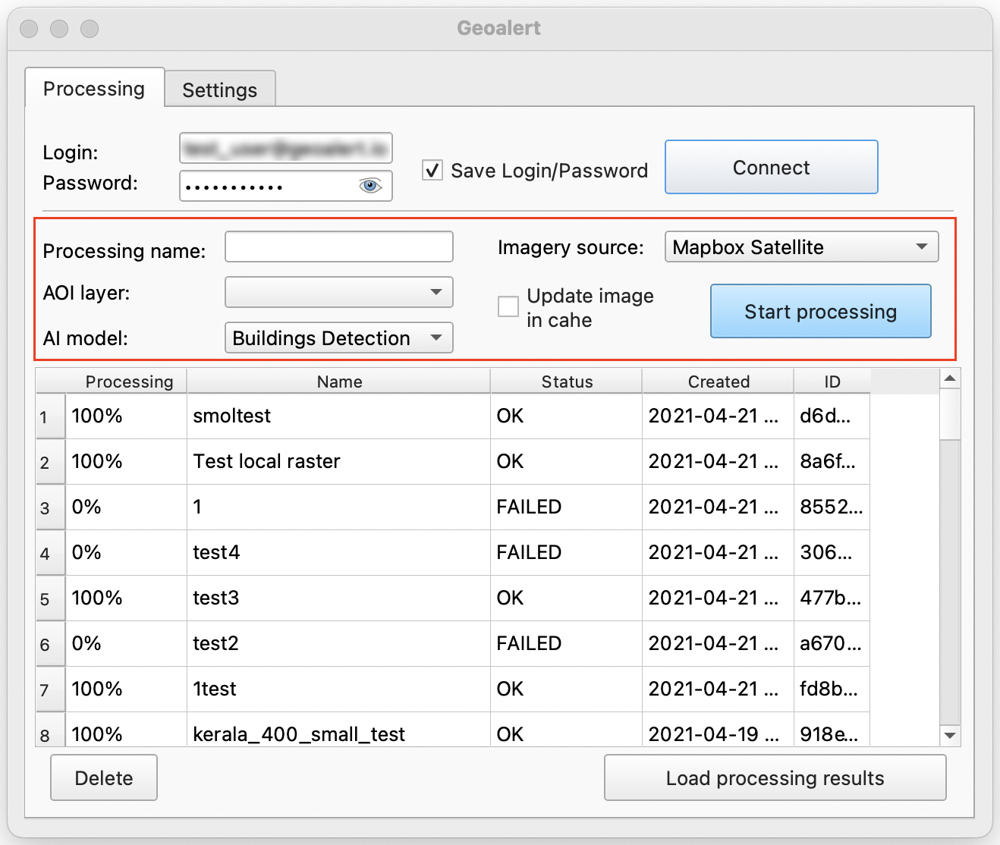
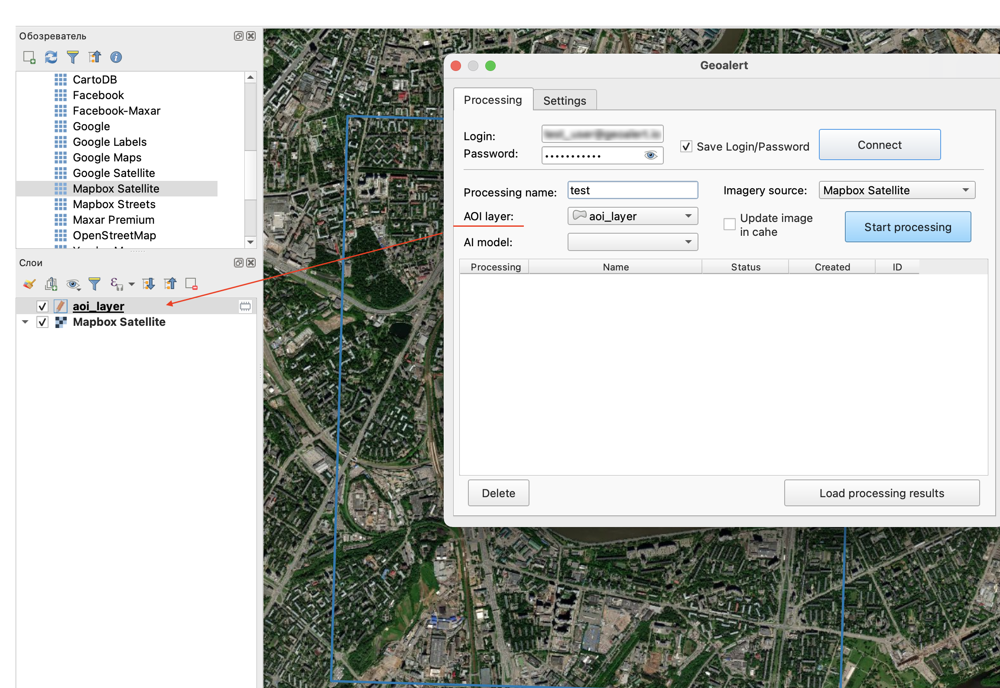

QGIS
=============

.. attention::
 Данное приложение позволяет использовать ресурсы обработки Mapflow в QGIS. Для его использования потребуется доступ к :doc:`processing_api`, для этого напишите нам на **help@geoalert.io**.

Что такое QGIS
---------------

QGIS - это ведущая и найболее популярная настольная ГИС с открытым исходным кодом. Пользователи могут визуализировать, управлять, редактировать, анализировать данные и составлять печатные карты. Узнайте больше на официальном сайте `QGIS <https://www.qgis.org/>`_. При помощи данной ГИС  вы сможете подключить больше приложений и расширить функциональность вашего ядра, поскольку данная система имеет ресурсы для подключения внешних плагинов Python. Наше приложение позволяет подключаться к Mapflow :doc:`processing_api` для запуска AI-моделей обработок и получать результаты процессинга в виде слоев для QGIS.

Пользовательский интерфейс
---------------------------

Рабочее окно плагина Geoalert разделено на 2 вкладки:

- **Processing**;
- **Settings**;

**Processing**

В данной вкладке пользователю предоставляется возможность зайти в свою учетную запись `mapflow.ai <https://mapflow.ai/en>`_, генерировать и запускать свои обработки в QGIS. 

Чтобы войти в свою учетную запись, следует заполнить поля *Login* и *Password*. Выбрав *Save Login/Password*, персональные данные пользователя сохранятся, чтобы не вводить их при повторном запуске плагина. При нажатии клавиши *Connect*, произойдет подключение к учетной записи и можно приступать к составлению запроса на обработку.

Внизу окна будет доступен просмотр и информация обо всех ранее произведенных обработках: их название, тип обработки, статус, дату создания и ID обработки.

.. figure:: _static/qgis/processing_area.png
         :alt: Processing area
         :align: center
         :width: 15cm

Рассмотрим область параметров обработки.

Поле *Processing name* соответствует названию обработки.

*AOI layer* - область, по которой будет производиться обработка. Данный слой автоматически отображается в выпадающем списке из списка растровых слоев QGIS, загрузите этот слой в QGIS или нарисуйте его.
                 

 
*AI model* - тип обработки. В выпадающем списке можно выбрать следующие типы обработки:

- *Building Detection* (определение зданий);
- *Roads Detection* (определение дорог); 
- *Forest Detection* (определение леса);
- *Buildings detection With Heights* (определение зданий с высотами);
- *Forest Detection With Heights* (определение леса с высотами).

*Imagery source* - подложка. По умолчанию выбран Mapbox Satellite, в выпадающем списке также можно выбрать Custom и Open new .tif.

Кнопка *Start processing* запустит новую обработку.
         
При помощи кнопки *Delete* можно удалить обработку из окна процессингов.

Кнопка *Load processing results* позволяет выгрузить полученный результат обработки в виде слоя в QGIS.
         

Как установить плагин
----------------------

Вам необходимо добавить внешний репозиторий с нашего сайта, нажать * Плагины * -> * Управление ... * -> * Добавить… * и заполнить форму с именем и `URL-адресом репозитория <https: // qgis .mapflow.ai / mapflow.xml> `_.
 
.. figure:: _static/qgis/add_repo.png
         :alt: Add repo
         :align: center
         :width: 15cm

После этого вы сможете увидеть, доступна ли более новая версия приложения, и проверить подробности в журнале изменений.
  

Как подключиться Maxar SecureWatch
------------------------------------

.. note::
    SecureWatch - это сервис, который обеспечивает гибкий доступ к оптическим снимкам, мирового лидера в области ДЗЗ, компании MAXAR. Пространственное разрешение снимков варьируется в диапазоне от 30 см до 1 м. Все снимки сопровождаются метаданными, включая информацию о дате и времени съемки, угле съемки и облачном покрове, пространственном разрешении, уровне обработка снимка и др.

На вкладке **Processing** в выпадающем списке *Imagery source* выберите *Custom (in setting)*.

 .. figure:: _static/qgis/Geoalert_processing.png
         :alt: Processing dialog
         :align: center
         :width: 15cm

2. Перейдите на вкладку **Setting**.
 
3. Введите ваши данные учетной записи  SecureWatch в поля *Login* и *Password*.

.. important:: 
Если у вас нет учетной записи, зарегистрируйтесь на официальном сайте `SecureWatch <https://explore.maxar.com/securewatch-demo>`_.
 
4. Выберите *Maxar Securewatch*. Введите ваше *Connect ID*:

     1. Перейдите на `SecureWatch <https://securewatch.digitalglobe.com/myDigitalGlobe/logout-from-ended-session>`_.

     2. В строке заголовка выберите свое имя, затем выберите **View Profile**. Откроется диалоговое окно **User Profile**.
 
     3. Скопируйте свой идентификатор подключения с поля **Current Connect ID**.
     
     .. figure:: _static/qgis/SecureWatch_user_profile.jpg
         :alt: Your user profile in SecureWatch
         :align: center
         :width: 15cm

     .. attention::
         Обратите внимание, что **Connect ID** для каждой из мозаик разный. Поэтому выберите изначально ту, которая вам подходит. Для этого закройте окно *User Profile* и в строке заголовка выберите нужную из двух предложенных мозаик (**Vivid** и **SecureWatch**), щелкнув по названию одной из них.

     4. Вернитесь в QGIS к плагину **Geoalert**, в поле *Connect ID* вставьте скопированный ID.
   
5. Нажмите *Get URL*. 
     
Теперь слой Maxar доступен для предварительного просмотра в вашем списке растровых слоев и для обработки AI-мэппинга с помощью Mapflow.

Как использовать другие сервисы изображений
-------------------------------------------

Вы можете ввести URL-адрес нужного источника изображений в одном из следующих форматов:

* XYZ
* TMS
* WMS

Все форматы представляют собой наиболее широко используемые протоколы для получения изображений с географической привязкой через http:
(Есть еще один тип, который поддерживается в Mapflow, это *quadkey*)

Как обрабатывать ваши собственные изображения
----------------------------------------------

Вы можете загрузить свой локальный растр в формате GeoTIF (*Open new .tif*). Каждый файл, добавленный в качестве растрового слоя в QGIS, отображается в раскрывающемся списке и может быть выбран для загрузки.

 .. figure:: _static/qgis/upload_tif.png
         :alt: Upload TIF, select from list
         :align: center
         :width: 15cm
