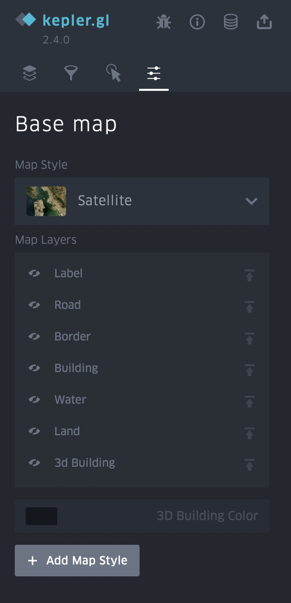

Как просмотреть результаты обработки с помощью Kepler
======================================================

**Kepler.gl** - веб-инструмент с открытым исходным кодом, разработанным в компании Uber, предназначенный для визуального и пространственного анализа геоданных. Это простой, но мощный инструмент, позволяющий отображать и исследовать наборы геоданных.

Для того чтобы просмотреть данные результата обработки Mapflow, достаточно выбрать нужную обработку и нажать кнопку *«Открыть в kepler.gl»*.

.. note::
   Кстати, вы можете поделиться ссылкой на вашу обработку, используя Kepler. (правый клик на кнопку *«Открыть в kepler.gl»* --> Скопировать ссылку)

Вы также можете изменить визуальные параметры отображения данных, установить фильтры, выбрать стиль базовой карты.

Вкладка Layers
^^^^^^^^^^^^^^^

Нажмите на название слоя, чтобы в раскрывающемся меню появились настройки слоя (*Layer settings*). Чтобы скрыть все данные, нажмите на иконку глаза.

.. figure:: _static/kepler/view_layer_settings.png
    :alt: View layer settings
    :align: center
    :width: 15cm

Эти настройки позволяют выбрать более подходящий вид полученных данных:

* *Fill color.* Можно выбрать любой цвет из палитры для полигонов, а также скрыть отображение данных, изменив положение ползунка. В дополнительных настройках данной функции можно изменить прозрачность полигонов (свойство *Opacity*).

* *Stroke color.* Можно выбрать любой цвет из палитры для обводки полигонов, а также вовсе  убрать обводку. В дополнительных настройках данной функции можно изменить прозрачность обводки (свойство *Opacity*).

* *Stroke width.* Управление толщиной обводки.

* *Height.* Позволяет просмотреть данные с высотами в 3D формате. Для этого установите нужный коэффициент и выберите атрибут слоя с высотами.

.. figure:: _static/kepler/3D_buildings.png
    :alt: 3D buildings
    :align: center
    :width: 15cm

Вкладка Filters
^^^^^^^^^^^^^^^^

Данная вкладка позволяет добавить интересующий фильтр по конкретному атрибуту слоя (как в данном случае, установлен фильтр по классам с различной типологией зданий). 

.. figure:: _static/kepler/filter_panel.png
    :alt: Filter panel
    :align: center
    :width: 15cm

Вкладка Interaction
^^^^^^^^^^^^^^^^^^^^

В данной вкладке можно выбрать или удалить атрибуты, которые будут видны в появляющемся меню, при наведении курсора на объект. Также возможна опция включения панели с указанием долготы и широты.

.. figure:: _static/kepler/interaction_panel.png
    :alt: Interaction panel
    :align: center
    :width: 15cm

Вкладка Base map
^^^^^^^^^^^^^^^^^

Здесь можно выбрать стили карты, а также выбрать отображение ее различных слоев.

