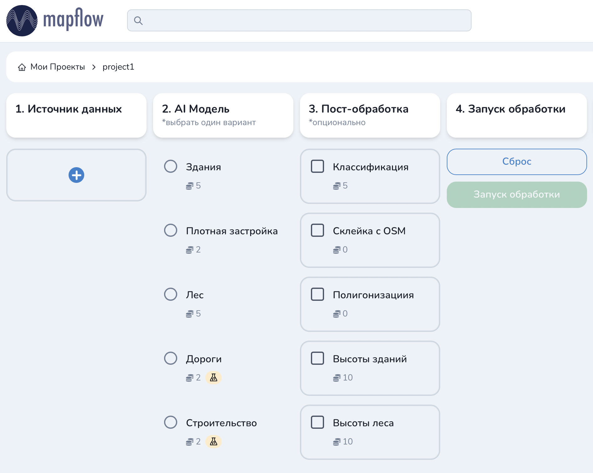
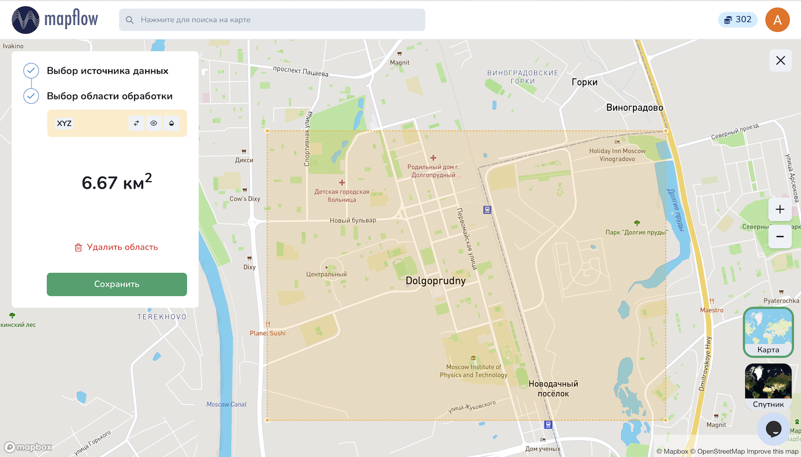
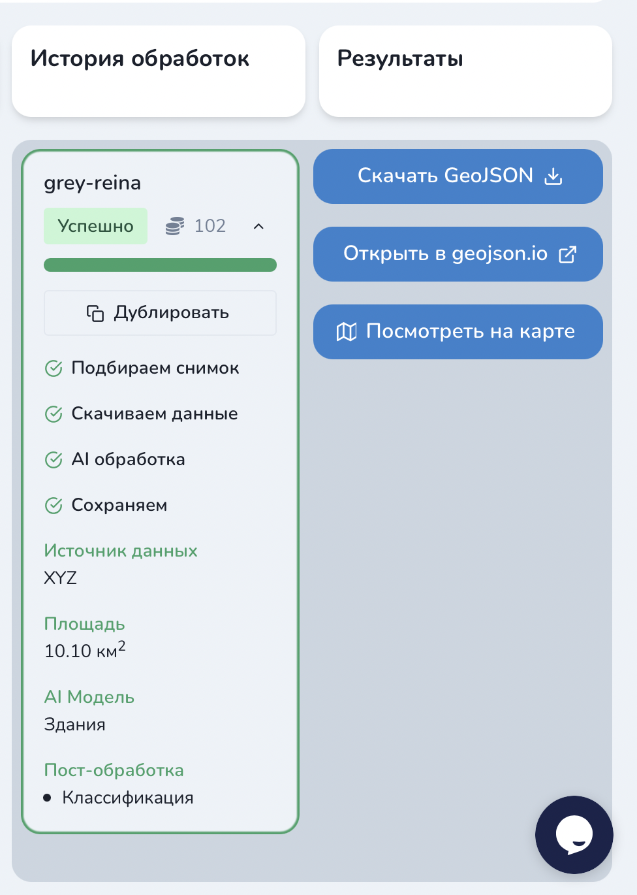
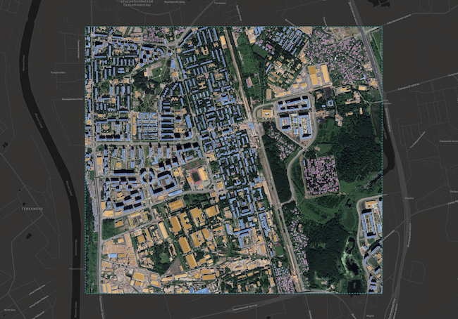
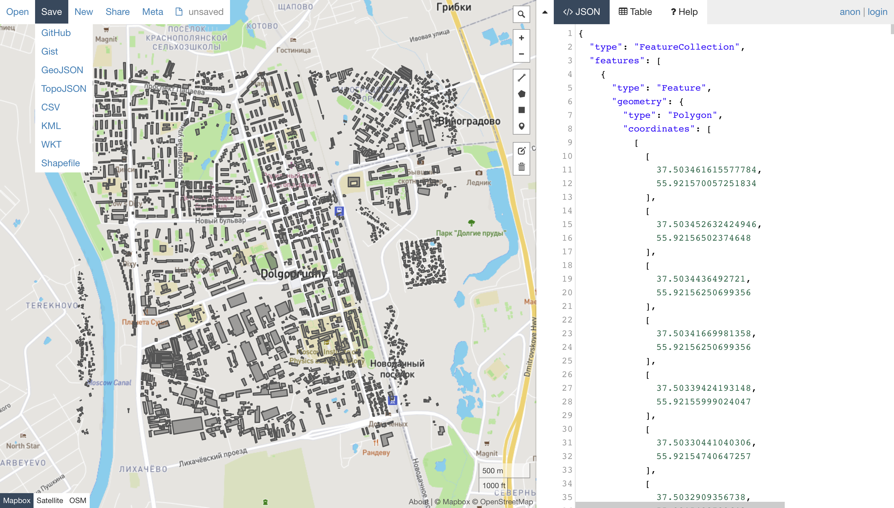

Начало работы
==============

Mapflow – Web-приложение
------------------------

1.0. Откройте web-приложение пройдя по ссылке https://app.mapflow.ai.

Зарегистрируйтесь или войдите используя свой Google аккаунт.

Как запускать обработку 
^^^^^^^^^^^^^^^^^^^^^^^

Пользоваться платформой очень просто.
Ниже отражен пошаговый процесс запуска обработки: 

1.1. Выбор "источника данных" – на этом шаге задается **географическая область на карте** и **источник данных / файл с изображением**, по которым должна быть осуществлена обработка.

.. HINT::
   Используйте GeoJSON - это очень удобный формат для обмена геоданными и отображения их на Web картах

Пример области обработки в формате GeoJSON

.. code:: json

    {
      "type": "Polygon",
      "coordinates": [
        [
          [
            37.490057513654946,
            55.923029653520395
          ],
          [
            37.490057513654946,
            55.949815087874605
          ],
          [
            37.54308202484029,
            55.949815087874605
          ],
          [
            37.54308202484029,
            55.923029653520395
          ],
          [
            37.490057513654946,
            55.923029653520395
          ]
        ]
      ]
    }

:download:`Скачайте GeoJSON <_static/_downloads/buildings_aoi.geojson>`

1.2. Платформа Mapflow получает данные ДЗЗ из глобальных источников, включая коммерческих провайдеров спутниковой съемки. Также возможно загружать свои собственные данные ДЗЗ для обработки.

.. IMPORTANT:: 
   В бета версии Mapflow Web доступен только дефолтный источник (**Mapbox Satellite**). Отправьте нам запрос на использование функционала API (см **API DOC**) если хотите задавать другие источники обработки или загружать файлы в формате GeoTIFF

2. Выберите одну из **Моделей обработки** (:doc:`См описание моделей <pipelines>`)

2.1. Выберите дополнительные параметры обработки (e.g. "Классификация" по типам зданий и "Высоты" для модели "Здания")

.. IMPORTANT::
   Опция обработки зданий с высотами доступна с ограничением по минимальной области обработки (от 50 кв.км)

3. Запустите процессинг и дождитесь результата |:coffee:| |:slight_smile:|

.. CAUTION::
   После выбора всех параметров процессинга - отображается общий скоринг стоимости обработки

Работа с результатами обработки
^^^^^^^^^^^^^^^^^^^^^^^^^^^^^^^

Результаты обработки сохраняются в панели "История обработок". 
При открытии карточки процессинга – отображается его статус, а также подсвечиваются выбранные параметры обработки, в основном окне.

.. IMPORTANT::
   При повторном запуске с теми же параметрами - запускается новая обработка.

После окончания процессинга, вы можете посмотреть результаты на интерактивной карте или скачать в виде векторных геоданных (GeoJSON).

#. "Посмотреть на карте" показывает результат обработки поверх исходного изображения. Это самый быстрый способ посмотреть результаты.

#. Скачать **GeoJSON** - формат геоданных, который нативно поддерживается Web-Map библиотеками, такими как **Leaflet** (https://leafletjs.com/) или ГИС такими как **QGIS** (https://qgis.org/).

#. "Открыть в geojson.io" - просмотр результатов во внешнем приложении с помощью прямой ссылки из Mapflow - пример: `geosjon.io <http://geojson.io/#data=data:application/json,%7B%22type%22%3A%20%22Polygon%22%2C%20%22coordinates%22%3A%20%5B%20%5B%20%5B%2037.490057513654946%2C%2055.923029653520395%20%5D%2C%20%5B%2037.490057513654946%2C%2055.949815087874605%20%5D%2C%20%5B%2037.543082024840288%2C%2055.949815087874605%20%5D%2C%20%5B%2037.543082024840288%2C%2055.923029653520395%20%5D%2C%20%5B%2037.490057513654946%2C%2055.923029653520395%20%5D%20%5D%20%5D%7D>`_ 

Это еще один встроенный способ посмотреть результаты и сохранить в других форматах (CSV, KML, GeoJSON, TopoJSON, WKT, Shapefile). Неплохо?! |:slight_smile:|

Работа с API
^^^^^^^^^^^^

Mapflow предоставляет сервис Rest API, чтобы запускать обработки и получать результаты из внешних приложений.
Если вы разрабатываете приложение и хотите использовать API - посмотрите :doc:`Документацию API <../docs_api/processing_api>` и свяжитесь с нами
